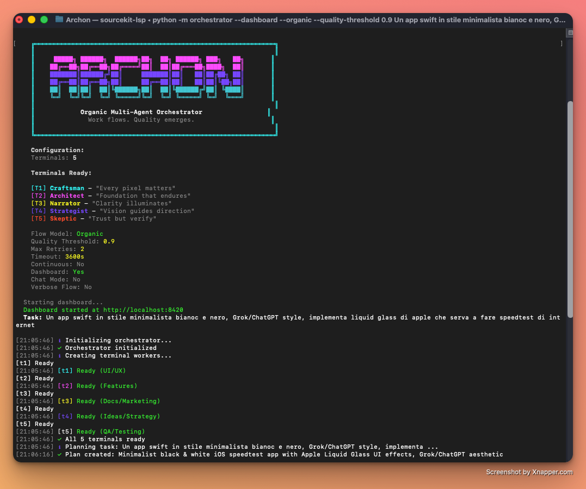

<p align="center">
  
</p>

<h1 align="center">ARCHON</h1>

<p align="center">
  <strong>Multi-Agent Development Orchestrator</strong><br>
  <sub>Autonomous software development through coordinated AI agents</sub>
</p>

<p align="center">
  <a href="#features"></a>
  <a href="#subagents"></a>
  <a href="#installation"></a>
  <a href="https://github.com/anthropics/claude-code"></a>
  <a href="LICENSE"></a>
</p>

---

## What is Archon?

Archon is an **AI manager** that coordinates **5 parallel Claude Code terminals** to build software autonomously. It operates like a real software company where engineers work in sync, share contracts, and deliver tested code.

```
You (CEO) → Archon (Manager) → 5 Terminals (Engineers) → Working Software
```

Give Archon a task like *"Create an iOS counter app"* and it will:

1. **Plan** → Define MVP scope, create interface contracts
2. **Build in Parallel** → All terminals start immediately, no waiting
3. **Coordinate in Real-Time** → Heartbeats, sync points, manager intelligence
4. **Test Continuously** → T5 validates builds throughout, not just at the end
5. **Deliver** → Complete, tested, documented application

---

## Quick Start

```bash
# Clone and setup
git clone https://github.com/martino-vigiani/Archon.git
cd Archon
python -m venv .venv && source .venv/bin/activate
pip install -r requirements.txt

# Run with dashboard (recommended)
python -m orchestrator --dashboard "Create a habit tracking iOS app"
```

### Requirements

- **Python 3.11+**
- **[Claude Code CLI](https://github.com/anthropics/claude-code)** installed and in PATH
- **Any paid Claude subscription** (Pro, Max, Team)
  - Recommended: **Max 5x** for heavy parallel usage without hitting rate limits

---

## Features

| Feature | Description |
|---------|-------------|
| **Company Mode** | Terminals work like a real team - synced, coordinated, accountable |
| **4-Phase Workflow** | Plan → Build → Integrate → Test |
| **Real-Time Coordination** | Heartbeats every 30s, sync points at phase boundaries |
| **Interface Contracts** | T1 defines expectations, T2 implements, T5 verifies |
| **Continuous Testing** | T5 validates builds throughout, not just Phase 3 |
| **Manager Intelligence** | Active coordination - detects conflicts, injects tasks, triggers sync |
| **15 Expert Subagents** | Specialized AI for SwiftUI, React, databases, testing, ML... |
| **Real-Time Dashboard** | Monitor progress at `localhost:8420` |

---

## How It Works: 4-Phase Execution

Archon runs all terminals **simultaneously** with intelligent coordination:

```
PHASE 0: PLANNING & CONTRACTS (2-5 min)
┌─────────────────────────────────────────────────────────────┐
│  T4 ──→ Broadcasts MVP scope to all terminals               │
│  T1 ──→ Creates interface contracts for T2                  │
│  T5 ──→ Sets up monitoring infrastructure                   │
└─────────────────────────────────────────────────────────────┘
                            ↓
PHASE 1: PARALLEL BUILD (10-20 min)
┌─────────────────────────────────────────────────────────────┐
│  T1 ──→ Creates UI with mock data                           │
│  T2 ──→ Builds architecture, models, tests                  │
│  T3 ──→ Creates documentation structure                     │
│  T5 ──→ Continuous build validation (every 2 min)           │
│                                                             │
│  📡 Heartbeats every 30s | Manager monitors for conflicts   │
└─────────────────────────────────────────────────────────────┘
                            ↓
         ═══════ SYNC POINT A: Mid-Build Check ═══════
                            ↓
PHASE 2: INTEGRATION (5-10 min)
┌─────────────────────────────────────────────────────────────┐
│  T1 ──→ Connects UI to T2's real APIs                       │
│  T2 ──→ Matches T1's interface contracts                    │
│  T5 ──→ Validates contract implementations                  │
└─────────────────────────────────────────────────────────────┘
                            ↓
         ═══════ SYNC POINT B: Pre-Release ═══════
                            ↓
PHASE 3: TEST & VERIFY (2-5 min)
┌─────────────────────────────────────────────────────────────┐
│  T5 ──→ Full test suite, quality gates                      │
│  T1 ──→ Verifies UI compilation and previews                │
│  T3 ──→ Finalizes documentation                             │
└─────────────────────────────────────────────────────────────┘
                            ↓
                    ✅ Working Software
```

---

## Company Mode Architecture

Archon's "Company Mode" transforms isolated terminals into a coordinated team:

### 1. Sync Protocol (Heartbeats)

Every terminal writes its status every 30 seconds:

```json
{
  "terminal": "t1",
  "status": "working",
  "current_task": "Create ProfileView",
  "progress": "60%",
  "files_touched": ["Views/ProfileView.swift"],
  "ready_artifacts": ["UserDisplayData interface"],
  "waiting_for": null
}
```

The orchestrator reads these heartbeats to:
- Detect blocked or stalled terminals
- Identify file conflicts
- Trigger sync points when ready

### 2. Interface Contracts

Terminals communicate expectations through formal contracts:

```json
// .orchestra/contracts/UserDisplayData.json
{
  "name": "UserDisplayData",
  "defined_by": "t1",
  "status": "proposed",
  "definition": {
    "fields": [
      {"name": "id", "type": "UUID"},
      {"name": "name", "type": "String"}
    ]
  }
}
```

**Lifecycle:**
1. **T1** creates contract (status: `proposed`)
2. **T2** implements and updates (status: `implemented`)
3. **T5** verifies match (status: `verified`)

### 3. Manager Intelligence

The orchestrator actively coordinates:

| Detection | Action |
|-----------|--------|
| Terminal blocked > 2 min | Inject unblocking task |
| T1 & T2 touching same file | Broadcast warning, pause one terminal |
| Interface mismatch | Inject fix task, notify both terminals |
| All Phase N tasks done | Trigger sync point |
| No heartbeat > 3 min | Escalate to user |

### 4. Continuous Testing (T5)

T5 doesn't wait for Phase 3 - it validates throughout:

| Phase | T5 Activity |
|-------|-------------|
| Phase 0 | Setup monitoring infrastructure |
| Phase 1 | Build check every 2 min, report errors immediately |
| Phase 2 | Verify contracts, integration tests |
| Phase 3 | Full test suite, quality gates, final report |

---

## Terminals & Subagents

### T1 - UI/UX (Autonomous)

**Principle:** *"Build first, integrate later"*

| Subagent | Specialty |
|----------|-----------|
| `swiftui-crafter` | iOS/macOS SwiftUI interfaces |
| `react-crafter` | React/Next.js components |
| `html-stylist` | HTML/CSS/Tailwind styling |
| `design-system` | Design tokens, colors, typography |

### T2 - Features (Autonomous)

**Principle:** *"Build the foundation fast"*

| Subagent | Specialty |
|----------|-----------|
| `swift-architect` | iOS architecture, MVVM, Clean Architecture |
| `node-architect` | Node.js/TypeScript backends |
| `python-architect` | Python apps, FastAPI, async |
| `swiftdata-expert` | SwiftData/CoreData persistence |
| `database-expert` | SQL, PostgreSQL, Prisma |
| `ml-engineer` | Machine learning, AI features |

### T3 - Documentation (Progressive)

**Principle:** *"Document as it's built"*

| Subagent | Specialty |
|----------|-----------|
| `tech-writer` | README, API docs, tutorials |
| `marketing-strategist` | App Store copy, positioning |

### T4 - Strategy (Non-blocking)

**Principle:** *"Guide, don't block"*

| Subagent | Specialty |
|----------|-----------|
| `product-thinker` | MVP scope, roadmaps, PRDs |
| `monetization-expert` | Pricing, business models |

### T5 - QA/Testing (Continuous)

**Principle:** *"Validate continuously, never block"*

| Subagent | Specialty |
|----------|-----------|
| `testing-genius` | Property-based testing, chaos engineering, fuzzing |
| `swift-architect` | iOS build validation, Swift tests |
| `node-architect` | Node.js tests, npm build verification |
| `python-architect` | pytest, Python validation |

---

## Usage

### Basic Commands

```bash
# Simple task
python -m orchestrator "Create a todo app with SwiftUI"

# With dashboard (recommended)
python -m orchestrator --dashboard "Build a REST API"

# Interactive chat mode - control execution in real-time
python -m orchestrator --chat "Create a meditation app"

# Continuous mode - keeps asking for new tasks
python -m orchestrator --dashboard --continuous

# Dry run - see the plan without executing
python -m orchestrator --dry-run "Create a meditation app"

# Work on existing project
python -m orchestrator --project ./MyApp "Add dark mode"

# Disable T5 testing (saves API limits)
python -m orchestrator --no-testing "Quick prototype"

# Combine flags
python -m orchestrator --chat --dashboard "Build a full-stack app"
```

### CLI Options

| Flag | Description |
|------|-------------|
| `--chat` | Interactive Manager Chat (control execution in real-time) |
| `--dashboard` | Start web UI at localhost:8420 |
| `--continuous` | Keep running, prompt for new tasks |
| `--dry-run` | Show plan without executing |
| `--project PATH` | Work on existing project |
| `--no-testing` | Disable T5 QA terminal (saves API limits) |
| `--max-retries N` | Retry failed tasks (default: 2) |
| `--timeout N` | Max execution time in seconds |
| `-v, --verbose` | Detailed output |
| `-q, --quiet` | Minimal output |

### Manager Chat (`--chat`)

Interactive REPL to communicate with Archon during execution:

```
> status              # Overall execution status
> status t1           # Status of specific terminal
> pause               # Pause execution
> resume              # Resume execution
> inject: Add login   # Add new task on the fly
> cancel <task_id>    # Cancel pending task
> tasks               # List all tasks
> reports             # Show terminal reports
> What has T2 built?  # Natural language questions (via Claude)
> help                # Show all commands
```

---

## Project Structure

```
Archon/
├── orchestrator/                # Core Python package
│   ├── orchestrator.py          # Main coordinator (phase-aware)
│   ├── planner.py               # Parallel-first task planning
│   ├── terminal.py              # Claude Code subprocess
│   ├── task_queue.py            # Phase-based task management
│   ├── message_bus.py           # Inter-terminal messaging
│   ├── report_manager.py        # Structured reports
│   │
│   │── # Company Mode Components
│   ├── sync_manager.py          # Heartbeat coordination
│   ├── contract_manager.py      # Interface contracts
│   ├── manager_intelligence.py  # Active manager decisions
│   ├── validator.py             # Continuous validation
│   │
│   ├── manager_chat.py          # Interactive chat REPL
│   └── dashboard.py             # FastAPI web UI
│
├── templates/
│   └── terminal_prompts/        # Autonomous terminal prompts
│       ├── t1_uiux.md           # "Build first, integrate later"
│       ├── t2_features.md       # "Build foundation fast"
│       ├── t3_docs.md           # "Document as it's built"
│       ├── t4_ideas.md          # "Guide, don't block"
│       └── t5_qa.md             # "Validate continuously"
│
├── .claude/
│   └── agents/                  # 15 subagent definitions
│
├── .orchestra/                  # Runtime state (gitignored)
│   ├── state/                   # Terminal heartbeats
│   ├── contracts/               # Interface contracts
│   ├── reports/                 # Terminal reports
│   ├── messages/                # Inter-terminal messages
│   ├── tasks/                   # Task queue files
│   └── qa/                      # T5 validation data
│
└── Apps/                        # Generated projects (gitignored)
```

---

## Example Output

**Prompt:** *"Create a simple iOS counter app"*

**What Archon builds:**

```
Apps/CounterApp/
├── Package.swift              # Swift package
├── README.md                  # Professional documentation
├── CHANGELOG.md               # Version history
├── docs/                      # API documentation
├── CounterApp/
│   ├── CounterAppApp.swift    # App entry point
│   ├── Models/
│   │   └── Counter.swift      # Business logic
│   ├── ViewModels/
│   │   └── CounterViewModel.swift
│   └── Views/
│       └── CounterView.swift  # SwiftUI UI
└── CounterAppTests/
    ├── CounterTests.swift
    └── CounterViewModelTests.swift
```

**Execution flow:**
1. **Phase 0** - T4 broadcasts MVP scope, T1 creates contracts, T5 sets up monitoring
2. **Phase 1** - T1 builds UI, T2 builds models, T3 creates docs, T5 validates builds
3. **Phase 2** - T1 connects to real APIs, T2 matches contracts
4. **Phase 3** - T5 runs full test suite, T3 finalizes docs

---

## Troubleshooting

| Problem | Solution |
|---------|----------|
| `claude: command not found` | Install [Claude Code CLI](https://github.com/anthropics/claude-code) |
| Rate limit hit | Use Max 5x subscription or use `--no-testing` |
| Dashboard not loading | Check if port 8420 is free: `lsof -i :8420` |
| Task stuck | Check `.orchestra/state/` for heartbeats |
| Tests failing | T5 will report to responsible terminal |
| Contract mismatch | Manager Intelligence will inject fix task |

---

## Contributing

```bash
# Fork and clone
git clone https://github.com/YOUR_USERNAME/Archon.git

# Create feature branch
git checkout -b feature/my-feature

# Make changes, then format
black orchestrator/
ruff check orchestrator/

# Commit and push
git commit -m "Add my feature"
git push origin feature/my-feature
```

PRs welcome! Please follow existing code style (Black + Ruff for Python).

---

## License

MIT License - see [LICENSE](LICENSE)

---

<p align="center">
  <sub>Built with <a href="https://github.com/anthropics/claude-code">Claude Code</a> by Anthropic</sub>
</p>
