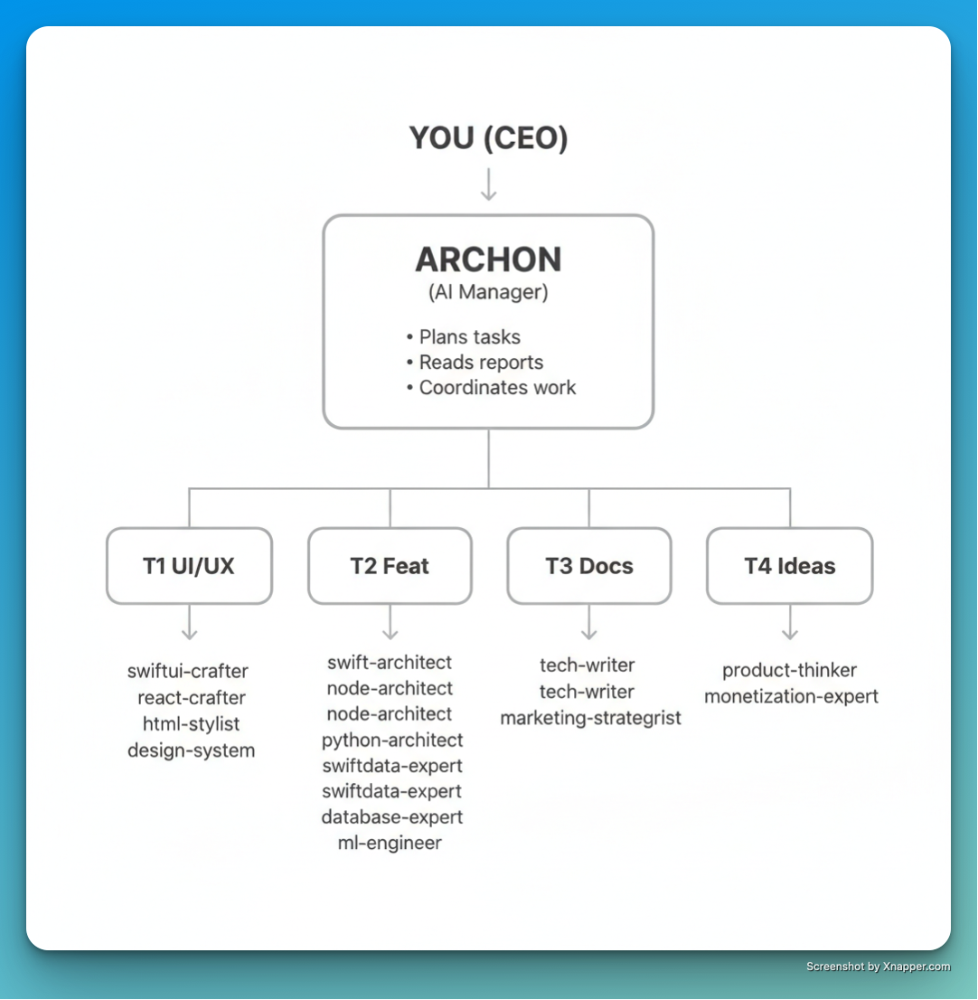
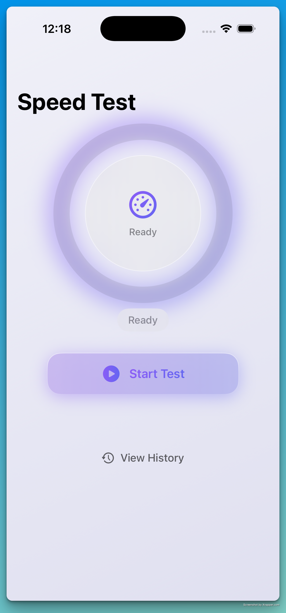
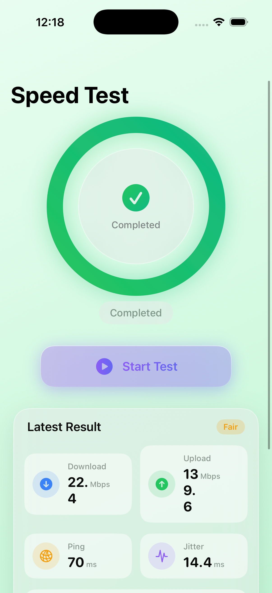

<p align="center">
  
</p>

<h1 align="center">ARCHON</h1>

<p align="center">
  <strong>Multi-Agent Development Orchestrator</strong><br>
  <sub>Autonomous software development through coordinated AI agents</sub>
</p>

<p align="center">
  <a href="#features"></a>
  <a href="#subagents"></a>
  <a href="#installation"></a>
  <a href="https://github.com/anthropics/claude-code"></a>
  <a href="LICENSE"></a>
</p>

---

## What is Archon?

Archon is an AI manager that coordinates **4 parallel Claude Code terminals** to build software autonomously. Instead of you switching between terminals and copying information manually, Archon does it for you.

```
You (CEO) → Archon (Manager) → 4 Terminals (Engineers) → Working Software
```

Give Archon a task like *"Create an iOS speed test app"* and it will:

1. **Plan** → Break down the task into parallel workstreams
2. **Execute in Parallel** → All 4 terminals start immediately, no waiting
3. **Self-Coordinate** → Terminals share interface contracts and adapt
4. **Test & Verify** → Built-in testing phase ensures working code
5. **Deliver** → Complete, tested application

---

## Quick Start

```bash
# Clone and setup
git clone https://github.com/martino-vigiani/Archon.git
cd Archon
python -m venv .venv && source .venv/bin/activate
pip install -r requirements.txt

# Run with dashboard
python -m orchestrator --dashboard --continuous "Create a habit tracking iOS app"
```

### Requirements

- **Python 3.11+**
- **[Claude Code CLI](https://github.com/anthropics/claude-code)** installed and in PATH
- **Any paid Claude subscription** (Pro, Max, Team)
  - Recommended: **Max 5x** for heavy parallel usage without hitting rate limits

---

## Features

| Feature | Description |
|---------|-------------|
| **True Parallel Execution** | All 4 terminals start immediately - no blocking dependencies |
| **3-Phase Workflow** | Build → Integrate → Test for reliable results |
| **Autonomous Terminals** | Each terminal makes decisions, uses mock data, self-verifies |
| **Interface Contracts** | T1 defines what it needs, T2 implements it |
| **Built-in Testing** | Phase 3 runs `swift build && swift test` automatically |
| **14 Expert Subagents** | Specialized AI for SwiftUI, React, databases, ML, marketing... |
| **Real-Time Dashboard** | Monitor progress at `localhost:8420` |

---

## How It Works: 3-Phase Parallel Execution

Unlike sequential systems, Archon runs all terminals **simultaneously** from the start:

```
PHASE 1: BUILD (All terminals start immediately)
┌─────────────────────────────────────────────────────────────┐
│  T1 ──→ Creates UI with mock data                           │
│  T2 ──→ Builds architecture and models                      │
│  T3 ──→ Creates documentation structure                     │
│  T4 ──→ Defines MVP scope (broadcasts in 2 min)             │
└─────────────────────────────────────────────────────────────┘
                            ↓
PHASE 2: INTEGRATE (When Phase 1 completes)
┌─────────────────────────────────────────────────────────────┐
│  T1 ──→ Connects UI to T2's real APIs                       │
│  T2 ──→ Matches T1's interface contracts                    │
└─────────────────────────────────────────────────────────────┘
                            ↓
PHASE 3: TEST & VERIFY (Final phase)
┌─────────────────────────────────────────────────────────────┐
│  T1 ──→ Verifies UI compilation and previews                │
│  T2 ──→ Runs all tests, fixes any failures                  │
│  T3 ──→ Finalizes documentation                             │
└─────────────────────────────────────────────────────────────┘
                            ↓
                    ✅ Working Software
```

### Key Innovation: Interface Contracts

Terminals don't wait for each other. Instead:

1. **T1** creates UI and documents what data it expects:
   ```swift
   // T1 INTERFACE CONTRACT
   // T2: Please implement a service matching this
   struct UserDisplayData {
       let id: UUID
       let name: String
       let avatarURL: URL?
   }
   ```

2. **T2** reads T1's contracts and implements matching APIs

3. **Phase 2** wires everything together

---

## Architecture

<p align="center">
  
</p>

---

## Terminals & Subagents

### T1 - UI/UX (Autonomous)

**Principle:** *"Build first, integrate later"*

| Subagent | Specialty |
|----------|-----------|
| `swiftui-crafter` | iOS/macOS SwiftUI interfaces |
| `react-crafter` | React/Next.js components |
| `html-stylist` | HTML/CSS/Tailwind styling |
| `design-system` | Design tokens, colors, typography |

### T2 - Features (Autonomous)

**Principle:** *"Build the foundation fast"*

| Subagent | Specialty |
|----------|-----------|
| `swift-architect` | iOS architecture, MVVM, Clean Architecture |
| `node-architect` | Node.js/TypeScript backends |
| `python-architect` | Python apps, FastAPI, async |
| `swiftdata-expert` | SwiftData/CoreData persistence |
| `database-expert` | SQL, PostgreSQL, Prisma |
| `ml-engineer` | Machine learning, AI features |

### T3 - Documentation (Progressive)

**Principle:** *"Document as it's built"*

| Subagent | Specialty |
|----------|-----------|
| `tech-writer` | README, API docs, tutorials |
| `marketing-strategist` | App Store copy, positioning |

### T4 - Strategy (Non-blocking)

**Principle:** *"Guide, don't block"*

| Subagent | Specialty |
|----------|-----------|
| `product-thinker` | MVP scope, roadmaps, PRDs |
| `monetization-expert` | Pricing, business models |

---

## Usage

### Basic Commands

```bash
# Simple task
python -m orchestrator "Create a todo app with SwiftUI"

# With dashboard (recommended)
python -m orchestrator --dashboard "Build a REST API"

# Continuous mode - keeps asking for new tasks
python -m orchestrator --dashboard --continuous

# Dry run - see the plan without executing
python -m orchestrator --dry-run "Create a meditation app"

# Work on existing project
python -m orchestrator --project ./MyApp "Add dark mode"

# Resume interrupted session
python -m orchestrator --resume
```

### CLI Options

| Flag | Description |
|------|-------------|
| `--dashboard` | Start web UI at localhost:8420 |
| `--continuous` | Keep running, prompt for new tasks |
| `--dry-run` | Show plan without executing |
| `--project PATH` | Work on existing project |
| `--parallel N` | Number of terminals (default: 4) |
| `--max-retries N` | Retry failed tasks (default: 2) |
| `--timeout N` | Max execution time in seconds |
| `-v, --verbose` | Detailed output |
| `-q, --quiet` | Minimal output |

---

## Example Output

**Prompt:** *"Create an iOS SpeedTest app with SwiftUI, minimalist design with liquid glass effects"*

<p align="center">
  
  &nbsp;&nbsp;&nbsp;
  
</p>

**What Archon built:**
- Complete SwiftUI app with MVVM architecture
- Network speed measurement service with unit tests
- Animated circular progress indicator
- Results display with Download, Upload, Ping, Jitter
- Test history with SwiftData persistence
- Verified: `swift build && swift test` passed

---

## Project Structure

```
Archon/
├── orchestrator/           # Core Python package
│   ├── orchestrator.py     # Main coordinator (phase-aware)
│   ├── planner.py          # Parallel-first task planning
│   ├── terminal.py         # Claude Code subprocess
│   ├── report_manager.py   # Structured reports & contracts
│   ├── message_bus.py      # Inter-terminal messaging
│   ├── task_queue.py       # Phase-based task management
│   └── dashboard.py        # FastAPI web UI
├── templates/
│   └── terminal_prompts/   # Autonomous terminal prompts
│       ├── t1_uiux.md      # "Build first, integrate later"
│       ├── t2_features.md  # "Build foundation fast" + tests
│       ├── t3_docs.md      # "Document as it's built"
│       └── t4_ideas.md     # "Guide, don't block"
├── .claude/
│   └── agents/             # 14 subagent definitions
├── .orchestra/             # Runtime state (gitignored)
└── Apps/                   # Generated projects (gitignored)
```

---

## Customization

### Customizing Terminals

Terminal prompts are in `templates/terminal_prompts/`. Each defines autonomous behavior:

```markdown
# Terminal T1 - UI/UX Specialist (Autonomous Mode)

## Core Principle: BUILD FIRST, INTEGRATE LATER

You don't wait for T2 to give you data models. You:
1. ASSUME reasonable data structures
2. CREATE the UI with mock/placeholder data
3. DESIGN interfaces that T2 will implement
4. DOCUMENT what you assumed so T2 can match it
```

### Creating Custom Subagents

Subagents are defined in `.claude/agents/`:

```yaml
# .claude/agents/my-custom-agent.yml
name: my-custom-agent
model: opus
tools: [Read, Write, Edit, Glob, Grep, Bash]
description: Brief description of specialty.
prompt: |
  You are an expert in [domain].
  ...
```

---

## Configuration

### Claude Settings (`.claude/settings.json`)

```json
{
  "permissions": {
    "allow": ["Read", "Write", "Edit", "Bash", "Glob", "Grep"],
    "deny": []
  },
  "model": "opus"
}
```

---

## Troubleshooting

| Problem | Solution |
|---------|----------|
| `claude: command not found` | Install [Claude Code CLI](https://github.com/anthropics/claude-code) |
| Rate limit hit | Use Max 5x subscription or wait for reset |
| Dashboard not loading | Check if port 8420 is free: `lsof -i :8420` |
| Task stuck | Check `.orchestra/` for state, restart orchestrator |
| Tests failing | Phase 3 will auto-retry; check `.orchestra/reports/t2/` |

---

## Contributing

```bash
# Fork and clone
git clone https://github.com/YOUR_USERNAME/Archon.git

# Create feature branch
git checkout -b feature/my-feature

# Make changes, then
git commit -m "Add my feature"
git push origin feature/my-feature
```

PRs welcome! Please follow existing code style (Black + Ruff for Python).

---

## License

MIT License - see [LICENSE](LICENSE)

---

<p align="center">
  <sub>Built with <a href="https://github.com/anthropics/claude-code">Claude Code</a> by Anthropic</sub>
</p>
