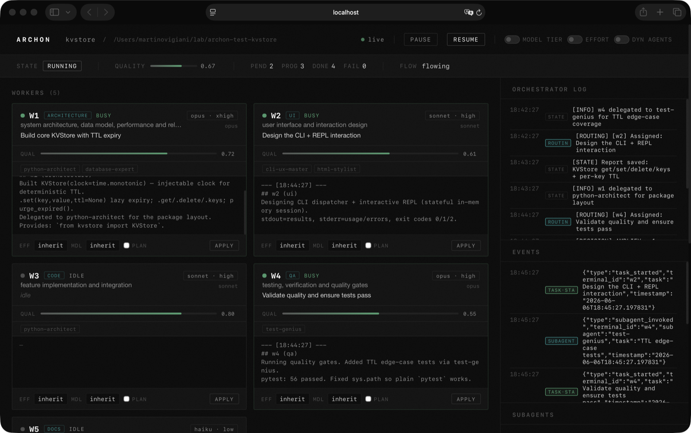
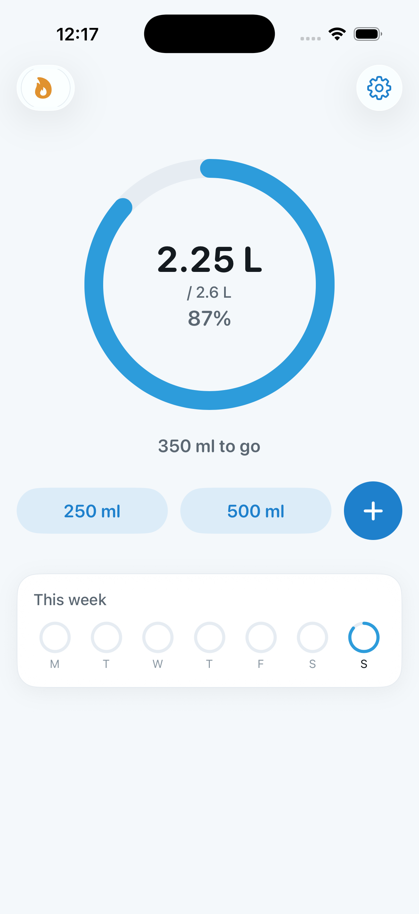
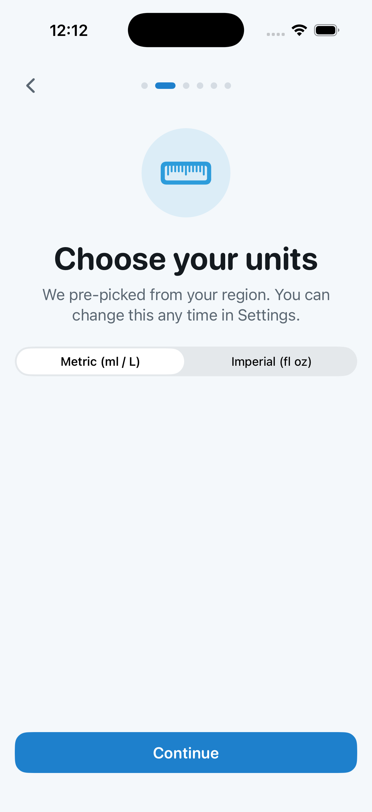

<p align="center">
  
</p>

<h1 align="center">ARCHON</h1>

<p align="center">
  <strong>Organic Multi-Agent Development</strong><br>
  <sub>Software that grows through collaborative intelligence</sub>
</p>

<p align="center">
  <a href="#worker-rosters"></a>
  <a href="#subagents"></a>
  <a href="#development"></a>
  <a href="#installation"></a>
  <a href="https://github.com/anthropics/claude-code"></a>
  <a href="LICENSE"></a>
</p>

---

## What is Archon?

Archon is a **gardener of intelligence** — it cultivates parallel Claude Code workers and guides them toward creating software through organic collaboration rather than rigid command.

Give Archon an **intent** like *"Create an iOS habit tracking app"* and it seeds that intent across a team of autonomous workers. Each worker is a non-interactive `claude --print` subprocess; the orchestrator observes quality, resolves conflicts, and intervenes surgically. Work is not binary (done / not done) — it exists on a continuous **quality gradient from 0.0 to 1.0**.

Workers come in two flavors: the classic **five fixed personalities** (T1–T5) or a **dynamic, task-shaped roster** (`--dynamic-agents`) derived from the goal — capability lanes with no fixed names or roles. Either way, the orchestrator composes each worker's execution mode (model tier, reasoning effort, plan mode, subagents) per task at a single chokepoint (`Config.build_llm_command`). An optional Codex runtime is also supported via `--llm-provider codex`.

```
                    ┌─────────────────┐
                    │     ARCHON      │
                    │   The Gardener  │
                    └────────┬────────┘
                             │
              ┌──────────────┼──────────────┐
              │   Observes   │   Nurtures   │
              │              │              │
    ┌─────────┴─────────────────────────────┴─────────┐
    │                                                 │
    │   T1          T2          T3          T4       T5
    │   The         The         The         The      The
    │   Craftsman   Architect   Narrator    Strategist Skeptic
    │                                                 │
    └─────────────────────┬───────────────────────────┘
                          │
              ┌───────────┴───────────┐
              │     NEGOTIATIONS      │
              │   Contracts & Flow    │
              └───────────────────────┘
```

---

## See it in action

Give Archon an intent, get working software. Asked to *"create a minimalist iOS water-tracking app"*, a dynamic worker roster produced a **compiling, unit-tested SwiftUI app** — 26 Swift files, a full Xcode project, onboarding, reminders, a design system and tests — autonomously, with zero failed tasks.

<p align="center">
  
  &nbsp;&nbsp;&nbsp;
  
</p>
<p align="center">
  <sub>An iOS app built end-to-end by Archon, running in the iOS Simulator. The control dashboard at the top of this page is how you watch it happen, live.</sub>
</p>

---

## Quick Start

```bash
# Clone and set up
git clone https://github.com/martino-vigiani/Archon.git
cd Archon
python -m venv .venv && source .venv/bin/activate
pip install -r requirements.txt

# Run with live dashboard (recommended)
python -m orchestrator --dashboard "Create a habit tracking iOS app"
```

**Requirements**

- Python 3.11+ (validated on 3.12)
- One supported runtime in PATH:
  - **[Claude Code CLI](https://github.com/anthropics/claude-code)** (default)
  - **Codex CLI** (`codex`) for `--llm-provider codex`
- Provider account access for the selected runtime

---

## Worker Rosters

`TerminalID` is a plain `str`, so both roster models are first-class citizens and can coexist in the same run.

### A. Fixed Personalities (T1–T5) — Default

Five named craftspeople with distinct worldviews. Each can invoke any of the 20 subagents regardless of home domain.

| Terminal | Personality | Home Domain | Motto |
|----------|-------------|-------------|-------|
| **T1** | The Craftsman | UI/UX | "Every pixel matters" |
| **T2** | The Architect | Backend/Systems | "Foundation that endures" |
| **T3** | The Narrator | Documentation | "Clarity illuminates" |
| **T4** | The Strategist | Product/Vision | "Vision guides direction" |
| **T5** | The Skeptic | QA/Testing | "Trust but verify" |

T5 is enabled by default and can be disabled with `--no-testing` to save API limits.

### B. Dynamic Task-Shaped Roster (`--dynamic-agents`)

Enable with `--dynamic-agents`. Archon derives a roster `w1..wN` from the actual goal — each worker gets a capability lane synthesized from what the task needs, with no fixed names or roles.

| Lane | Kind | Default execution profile |
|------|------|--------------------------|
| `architecture` | ARCHITECTURE | deep model, high effort |
| `ui` | UI | standard model, medium effort |
| `code` | CODE | standard model, high effort (always present) |
| `qa` | QA | standard model, high effort (unless `--no-testing`) |
| `docs` | DOCS | cheap model, low effort |
| `strategy` | STRATEGY | standard model, medium effort |

Dynamic workers reference curated subagents by name — the Claude CLI auto-discovers `.claude/agents/*.md` lazily. Full agent bodies are not re-sent on every task call.

---

## Execution Modes

Every task is a single non-interactive `claude --print` call. Archon switches the same controls a human would toggle by hand, bundled per task in an `ExecutionProfile` composed into CLI flags at one chokepoint — `Config.build_llm_command`.

| Control | Flag | Default |
|---------|------|---------|
| Model tier (cheap/standard/deep → haiku/sonnet/opus) | `--model` | `INHERIT` (CLI default); opt-in with `--model-tiering` |
| Reasoning effort low…max | `--effort` | On by default; disable with `--no-effort-dial` |
| Plan mode | `--permission-mode plan` | Off; togglable per task or via control plane |
| Dynamic subagents | `--agents` | Ad-hoc; curated subagents auto-discovered by name |
| Cacheable persona | `--append-system-prompt` | Always on; prompt-cache friendly |
| LLM report parsing | local regex | Local by default (no extra LLM call) |

**Note on `--bare`:** `ExecutionProfile.bare` skips hooks, LSP, auto-memory, and CLAUDE.md discovery (RAM + token saver), but it forces `ANTHROPIC_API_KEY` auth and bypasses OAuth / keychain. It is `False` by default. Enable only when an API key is explicitly configured.

### Token & RAM Efficiency

- **Local report parsing** (default) — worker output is parsed with regex, not an extra LLM call
- **Cacheable system prompt** — persona sent via `--append-system-prompt`, not re-inline every call
- **Compact prompts** — loaded from `templates/terminal_prompts_compact/` when available; disable with `--full-prompts`
- **Output rotation** — worker stdout capped at 64 KB per task
- **Ring-buffered event log** — 100-event ring buffer; oldest events drop silently
- **Model tiering** — opt-in; cheap tasks run on haiku, deep reasoning reserves opus
- **Effort dial** — on by default; low/medium effort for mechanical work
- **Shared-state dashboard cache** — status JSON written once, read by all dashboard API endpoints

---

## Live Control Dashboard

Start with `--dashboard`. Opens at **http://localhost:8420** — a multi-route single-page app (the "MONO" control plane: neutral monochrome surfaces, one accent, status carried by color only where it means something, dark + light).

**Routes:** Dashboard (live agents, metrics, quality, feeds) · New Run (launch + configure a run, pick a working directory, preview the roster) · Sessions (every run, switch between them) · Chat (talk to the orchestrator, with session memory) · Files (what each agent created) · Workspace (agent / file / contract graph).

**The Dashboard route shows:**
- Per-agent runtime chip: provider · model · effort · prompt-adherence (so you always know *which model* each agent is running)
- Execution mode badges (model tier, effort, plan mode) and quality gradient bars (0.0–1.0) per agent
- Live terminal output and a tabbed Orchestrator / Events / Subagents feed
- Manager interventions timeline (AMPLIFY / REDIRECT / MEDIATE / INJECT / PRUNE)
- Stuck / needs-input detection with an inline reply, instructive empty + skeleton states, WCAG AA contrast

**Control plane — POST endpoints:**

| Endpoint | Body | Effect |
|----------|------|--------|
| `POST /api/control/pause` | — | Pause all workers |
| `POST /api/control/resume` | — | Resume workers |
| `POST /api/control/inject` | `{title, description?, target?, priority?, ...profile}` | Inject a new task with optional execution profile |
| `POST /api/control/mode` | `{target, ...profile}` or `{target, clear:true}` | Override (or clear) a single worker's execution mode |
| `POST /api/control/config` | `{model_tiering?, effort_dial?, dynamic_agents?}` | Toggle config flags live |
| `POST /api/control/cancel` | `{task_id}` | Cancel a pending task |
| `POST /api/control/spawn` | `{...profile}` | Spawn an extra agent mid-run |
| `POST /api/control/chat` | `{message, session?}` | Ask the orchestrator a question (reply via `GET /api/chat/replies`) |
| `POST /api/runs` | `{goal, ...flags}` | Launch a new run from the UI (New Run route) |

The control plane is **file-based** (`ControlChannel` writes JSON commands to `.orchestra/`). Commands are applied by the orchestrator's main loop even while execution is paused.

---

## CLI Reference

```bash
# Basic
python -m orchestrator "Create a todo app with SwiftUI"

# With dashboard (recommended)
python -m orchestrator --dashboard "Build a REST API"

# Interactive chat — guide the run in real-time
python -m orchestrator --chat --dashboard "Create a meditation app"

# Dry run — see the plan without executing
python -m orchestrator --dry-run "Build a REST API"

# Work on an existing project
python -m orchestrator --project ./Apps/MyApp "Add dark mode"

# Long-running task with no timeout
python -m orchestrator --timeout inf "Large-scale migration"

# Disable T5 to save API limits
python -m orchestrator --no-testing "Quick prototype"

# Dynamic task-shaped roster
python -m orchestrator --dynamic-agents --dashboard "Build a full-stack app"

# Codex runtime
python -m orchestrator --llm-provider codex --llm-model gpt-5.3-codex --dashboard "Your task"

# Resume interrupted session
python -m orchestrator --resume
```

**All flags:**

| Flag | Default | Description |
|------|---------|-------------|
| `task` (positional) | — | High-level intent to execute |
| `--dashboard` | off | Start web UI at localhost:8420 |
| `--chat` | off | Interactive Manager Chat REPL |
| `--continuous` | off | Prompt for a new task after each completion |
| `--dry-run` | off | Show plan without executing |
| `--project PATH` | — | Work on an existing project directory |
| `--infer-project` / `--no-infer-project` | on | Infer project path from task text |
| `--resume` | off | Resume the last interrupted session |
| `--no-testing` | off | Disable T5 QA worker (saves API limits) |
| `--parallel N` | 4 (max 10) | Number of parallel workers |
| `--max-retries N` | 2 | Max retries for failed tasks |
| `--timeout SECONDS\|inf` | inf | Max execution time; `inf` = no limit |
| `--quality-threshold LEVEL` | 0.8 | Minimum quality level (0.0–1.0) |
| `--verbose-flow` | off | Show detailed flow-state changes |
| `--config PATH` | — | Path to a custom config JSON |
| `--llm-provider` | claude | Runtime provider: `claude` or `codex` |
| `--llm-command CMD` | — | Override LLM CLI command |
| `--llm-model MODEL` | — | Model id passed to the selected provider |
| `--dynamic-agents` | off | Derive task-shaped roster `w1..wN` (opt-in) |
| `--model-tiering` | off | Per-task model tier selection (opt-in) |
| `--no-effort-dial` | off | Disable per-task reasoning effort |
| `--full-prompts` | off | Use full prompt templates (disables compact mode) |
| `--max-system-prompt-chars N` | 4200 | Max chars per system prompt |
| `--append-system-prompt TEXT` | — | Append cacheable text to every system prompt |
| `-v, --verbose` | off | Detailed output |
| `-q, --quiet` | off | Minimal output |

### Manager Chat (`--chat`)

Interactive REPL to steer the run:

```
> status              # Overall health
> status t1           # Health of a specific worker
> pause / resume      # Pause or resume execution
> inject: Add login   # Inject a new intent
> cancel <task_id>    # Cancel a pending task
> tasks               # List all active tasks
> reports             # Show worker reports
> What has T2 built?  # Natural language query (via Claude)
> help                # All commands
```

---

## Philosophy: The Gardener Model

Archon rejects rigid phase gates and factory-line orchestration. Work **flows** naturally.

| Traditional | Archon |
|-------------|--------|
| **Task** — "Do exactly this" | **Intent** — "We want to achieve this" |
| **Phase** — A → B → C | **Flow** — Work naturally, negotiate as needed |
| **Distribution** — Manager assigns all work | **Observation** — Workers choose, manager guides |
| **Binary status** — Done or not done | **Quality gradient** — 0.0 to 1.0 |

### Quality Gradient

| Quality | Meaning | Action |
|---------|---------|--------|
| 0.0–0.2 | Sketch / concept | Needs substantial work |
| 0.2–0.4 | Draft | Structure exists, needs refinement |
| 0.4–0.6 | Working | Functional but rough edges |
| 0.6–0.8 | Solid | Ready for integration |
| 0.8–0.9 | Polished | Production-ready |
| 0.9–1.0 | Excellent | Exceeds expectations |

### Manager Interventions

The gardener does not dictate — it tends. Five intervention types:

| Intervention | When | Example |
|--------------|------|---------|
| **AMPLIFY** | Something is working well | "T1's approach is excellent — T2 adopt similar patterns" |
| **REDIRECT** | Duplicate or wasted effort | "T2, stop — T1 already solved this better" |
| **MEDIATE** | Workers disagree | "T1 and T2 need to align on this interface" |
| **INJECT** | Gap nobody is filling | "Nobody is handling auth — T2, take this" |
| **PRUNE** | Approach is not working | "Abandon this direction, try something else" |

---

## Subagents

20 specialist subagents live in `.claude/agents/`. Any worker — fixed or dynamic — can invoke any subagent. Dynamic workers reference curated ones by name; the CLI auto-discovers them.

| Domain | Subagent |
|--------|----------|
| iOS UI | `swiftui-crafter` |
| Web UI | `react-crafter` |
| Styling | `html-stylist` |
| Design tokens | `design-system` |
| Web design | `web-ui-designer` |
| Dashboards | `dashboard-architect` |
| iOS architecture | `swift-architect` |
| Node.js architecture | `node-architect` |
| Python architecture | `python-architect` |
| iOS data | `swiftdata-expert` |
| Database | `database-expert` |
| ML/AI | `ml-engineer` |
| Testing | `test-genius` |
| Documentation | `tech-writer` |
| Marketing | `marketing-strategist` |
| Product | `product-thinker` |
| Business model | `monetization-expert` |
| CLI UX | `cli-ux-master` |
| Claude Code tooling | `claude-code-toolsmith` |
| Prompt engineering | `prompt-craftsman` |

---

## Codex Mode

Pass `--llm-provider codex` to run workers through the Codex CLI instead of Claude Code:

```bash
python -m orchestrator \
  --llm-provider codex \
  --llm-model gpt-5.3-codex \
  --dashboard "Your task"
```

See [CODEX_SPECIALIST_TEAM.md](docs/CODEX_SPECIALIST_TEAM.md) for Codex 5.3 specialist roles (`high`/`xhigh` reasoning), handoff patterns, and autonomy workflow.

Useful flags for Codex runs:
- `--full-prompts` — disable compact prompts
- `--max-system-prompt-chars N` — control system-prompt token budget

---

## Project Structure

```
Archon/
├── orchestrator/                # Core Python package
│   ├── orchestrator.py          # The Gardener — main coordinator loop
│   ├── planner.py               # Intent interpretation and task seeding
│   ├── terminal.py              # Claude Code subprocess wrapper
│   ├── task_queue.py            # Flow-based work management
│   ├── execution.py             # ExecutionProfile, ModelTier, Effort, PermissionMode
│   ├── dynamic_agents.py        # Dynamic roster derivation (w1..wN, capability lanes)
│   ├── control.py               # ControlChannel — file-based command bus
│   ├── session.py               # Session load/resume/dry-run helpers
│   ├── config.py                # Config + build_llm_command chokepoint
│   ├── message_bus.py           # Inter-worker negotiation
│   ├── report_manager.py        # Artifact and quality gradient tracking
│   ├── sync_manager.py          # Heartbeat coordination
│   ├── contract_manager.py      # Interface negotiation contracts
│   ├── manager_intelligence.py  # Intervention decisions
│   ├── validator.py             # Continuous validation
│   ├── logger.py                # Event logging (ring-buffered, 100 events)
│   ├── manager_chat.py          # Interactive chat REPL
│   ├── dashboard.py             # FastAPI web UI at localhost:8420
│   ├── cli_display.py           # Colors, badges, quality bars, display utilities
│   ├── live_api.py              # Live API helpers
│   ├── api_client.py            # Provider API client
│   ├── auth/                    # Authentication modules
│   └── static/                  # Dashboard HTML, CSS, JS assets
│
├── templates/
│   ├── terminal_prompts/        # Full personality templates (T1–T5)
│   └── terminal_prompts_compact/# Compact variants (token-efficient)
│
├── .claude/
│   └── agents/                  # 20 subagent definitions
│
├── docs/                        # Documentation (see Docs section)
│
├── tests/                       # 24 backend test files, 754 passing
│
├── .orchestra/                  # Runtime state — gitignored
│   ├── state/                   # Worker heartbeats
│   ├── contracts/               # Negotiation contracts
│   ├── reports/                 # Worker artifacts
│   ├── messages/                # Inter-worker messages
│   ├── tasks/                   # Task queue
│   └── qa/                      # QA validation data
│
└── Apps/                        # Generated projects — gitignored
```

---

## Development

```bash
# Install dev dependencies
pip install -r requirements-dev.txt

# Install frontend dependencies (dashboard)
npm install

# Run backend tests (754 tests, 24 files)
pytest

# Run frontend tests (6 tests, 2 files)
npx vitest

# Format and lint
black orchestrator/
ruff check orchestrator/

# Available make targets
make help
```

Python 3.11+ required; validated on 3.12. The frontend test suite (6 tests) covers dashboard interaction modules; passing count is noted in prose rather than a badge because the frontend suite is separate from the main pytest run.

---

## Docs

| Guide | Purpose |
|-------|---------|
| [ARCHITECTURE.md](docs/ARCHITECTURE.md) | System architecture and organic model |
| [API_REFERENCE.md](docs/API_REFERENCE.md) | Dashboard API endpoints |
| [ARCHITECTURE_AND_SECURITY.md](docs/ARCHITECTURE_AND_SECURITY.md) | Security architecture |
| [AUTH_GUIDE.md](docs/AUTH_GUIDE.md) | Authentication setup |
| [DESIGN_DECISIONS.md](docs/DESIGN_DECISIONS.md) | Key architectural decisions and rationale |
| [GETTING_STARTED.md](docs/GETTING_STARTED.md) | Detailed setup guide |
| [SETUP.md](docs/SETUP.md) | Configuration reference |
| [PRD.md](docs/PRD.md) | Product requirements document |
| [diagrams.md](docs/diagrams.md) | Visual architecture diagrams |
| [CODEX_SPECIALIST_TEAM.md](docs/CODEX_SPECIALIST_TEAM.md) | Codex 5.3 specialist roles, handoffs, autonomy workflow |
| [REVOLUTIONARY_IDEAS.md](docs/REVOLUTIONARY_IDEAS.md) | Next-evolution roadmap |

---

## Troubleshooting

| Problem | Solution |
|---------|----------|
| `claude: command not found` | Install [Claude Code CLI](https://github.com/anthropics/claude-code) |
| Rate limit hit | Use a Max 5x subscription or pass `--no-testing` |
| Dashboard not loading | Check if port 8420 is free: `lsof -i :8420` |
| Run stalled | Check `.orchestra/state/` for worker heartbeats |
| Quality not improving | T5 reports issues to the responsible worker |
| Contract mismatch | The manager mediates; see MEDIATE interventions in the dashboard |

---

## Contributing

```bash
# Fork and clone
git clone https://github.com/YOUR_USERNAME/Archon.git

# Create a feature branch
git checkout -b feature/my-feature

# Make changes, then format
black orchestrator/
ruff check orchestrator/

# Run tests
pytest

# Commit and push
git commit -m "Add my feature"
git push origin feature/my-feature
```

PRs welcome. Follow existing code style (Black + Ruff for Python, TypeScript for dashboard JS). See [CONTRIBUTING.md](CONTRIBUTING.md) for the full setup, workflow, and pre-PR checklist.

---

## License

MIT License — see [LICENSE](LICENSE)

---

<p align="center">
  <sub>Built with <a href="https://github.com/anthropics/claude-code">Claude Code</a> by Anthropic</sub>
</p>
